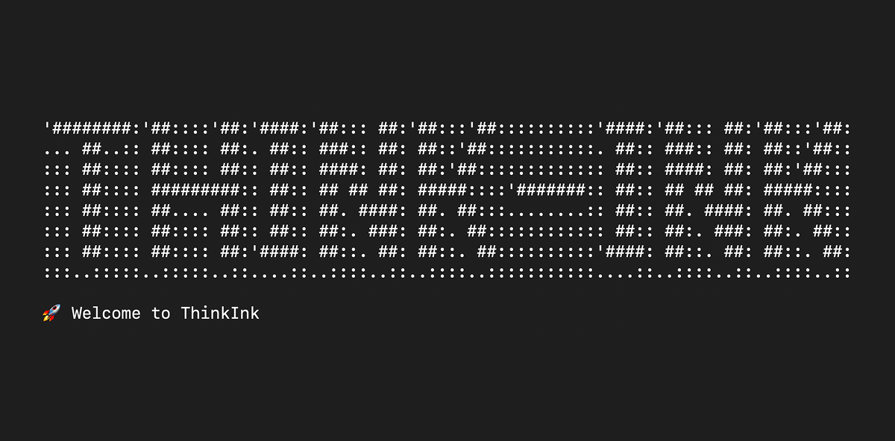

# ThinkInk - Elevate Your Professional Writing with AI

## 🚀 Why ThinkInk?
In today’s fast-paced professional world, the ability to communicate clearly, think critically, and respond effectively is crucial. ThinkInk is an AI-powered writing coach that helps you sharpen your professional writing, behavioral thinking, and critical reasoning—all within the simplicity of your terminal.

Whether you're preparing for a job interview, improving workplace communication, or just honing your writing skills, ThinkInk provides structured, real-world writing exercises to enhance your skills.

* **Want to improve decision-making?** The AI generates behavioral and critical thinking challenges to **train your mind** to respond effectively.
* **Lack feedback on your writing?** ThinkInk doesn’t just stop at writing; it analyzes your response and generates a **detailed AI-powered feedback report** in PDF format.
* **Short on time?** Unlike traditional writing courses, ThinkInk is designed for busy professionals—each session is **short and actionable**.
